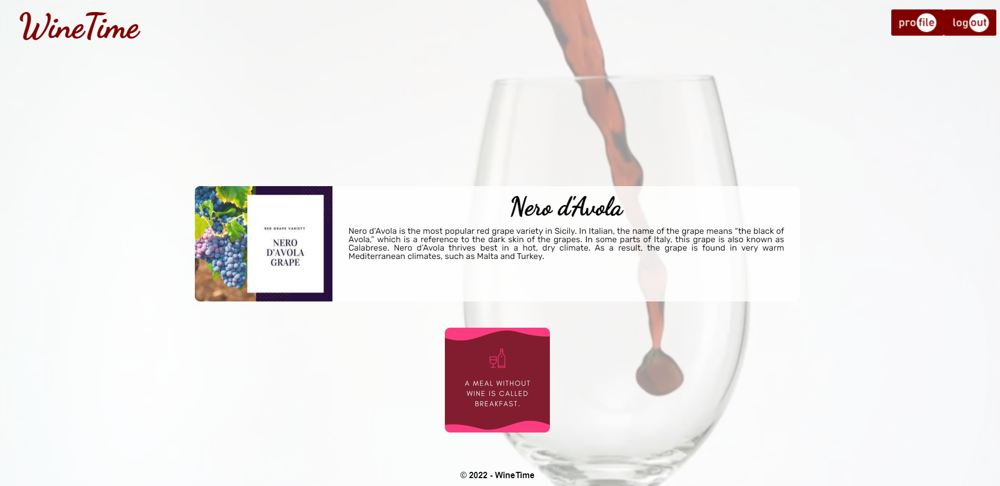

## Wine Time

##  The Task

The task was develop a full MERN stack single page application, with requirements of logging in, database management with full CRUD functionality, responsiveness, as well as having a well polished design.

### ⭐ ⭐ S.T.A.R. ⭐ ⭐

**SITUATION**

> AS A wine drinker and collector
> 
> I WANT an application to track my collection and recommend drinks to me
>
> SO THAT I can see which drinks are in their peak drinking window, try new wines that I may like, and provide any further information that may interest me.

**TASK**

Create an application that allows a user to enter details of their wine collection, which will learn about them over time and recommend wines based on what they enjoy. The app should also provide information on the collection.

**ACTION**

Development of a Mongo database, querying via GraphQL and handling with Express and Node, then displayed via React. Connection to API's to pull data. Displaying the data with React without errors.

Running data through self developed algorithm to be able to recommend wines to the user based on previous wines they've consumed.

**RESULT**

Not every required feature was developed. The database was functional, the implemented queries and mutations worked. Node & Express worked as needed. React displays the data available.

The API integration worked, but was unable to be displayed. Several features work, however statistics did not, neither was the algorithm integrated.

Log in, log out, and sign up did work, and the UI was reasonably polished.

##  The Outcome

The full criteria was not met, however the structure was developed and all features would be addable over time. A basic MVP was delivered.

You can view the Github repo [HERE](https://github.com/NBS5000/wineTime)

You can view the deployed application here [HERE](https://nbs-winetime.herokuapp.com/)

Here is a screenshot of the application:

> 

---

Written by Steve Barry - Due date 19/05/2022

© 2021 Trilogy Education Services, LLC, a 2U, Inc. brand. Confidential and Proprietary. All Rights Reserved.

